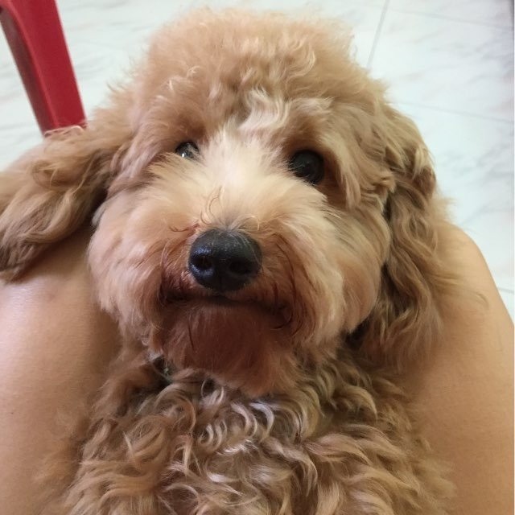

Welcome to my little corner of the internet!

I'm **Tan Jian Ying Ivan**, a Year 1 student in the *Applied Artificial Intelligence* (AAI) programme at the [Singapore Institute of Technology](https://www.singaporetech.edu.sg/). This site is where I'll be sharing what I'm learning, things I'm building, and a few bits of life outside the classroom.

{width=60% fig-align="center"}

## A bit about me

When I'm not in lectures or tinkering with code, you'll probably find me:

- 🏃 **Running** — clearing my head one kilometre at a time
- 🏋️ **Working out** — the most consistent way I've found to push myself outside of school
- 🌱 **Tending to my plants** — a small but growing collection
- 🐶 **Hanging out with Kimchi**, my toy poodle (more on him below)

## Meet Kimchi 🐾

::: {style="float:left; position: relative; top: 0px"}
{height="160px" style="margin-right: 15px"}
:::

Kimchi is my toy poodle and unofficial study buddy. He has a talent for showing up exactly when I'm trying to focus and being too cute to ignore. He is, objectively, the best dog.

## What you'll find here

Have a look around — there's a bit of everything:

- A [project](project.qmd) I'm proud of
- A [data visualization](dataviz.qmd) with the story behind it
- My [reflection on using GenAI](genai-reflection.qmd) in my studies

Thanks for stopping by!